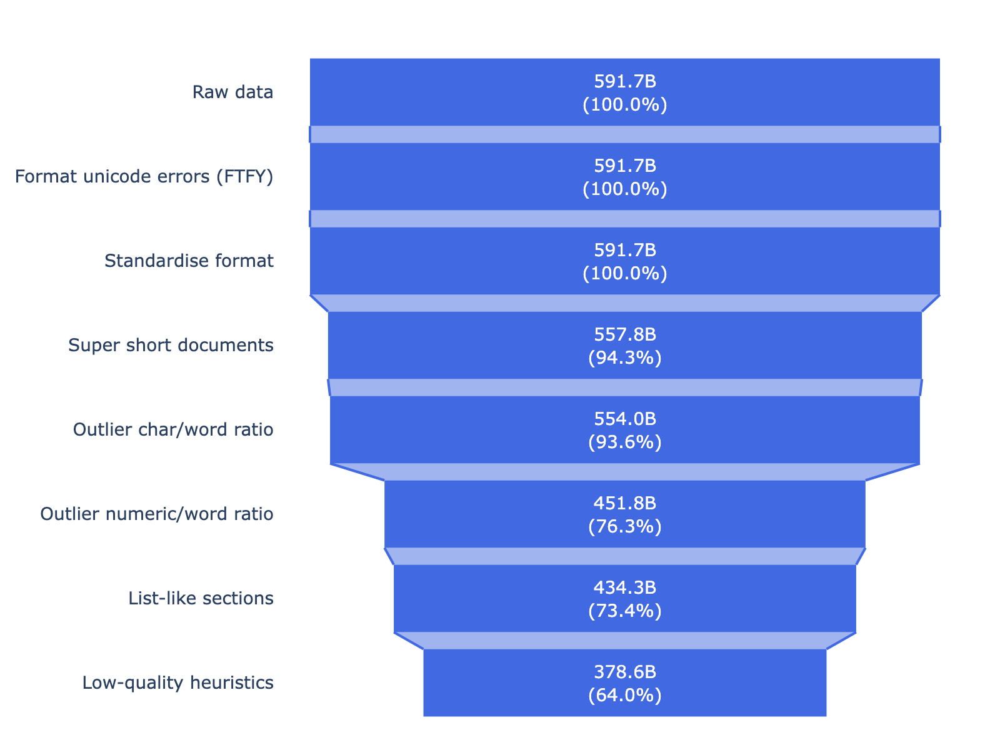
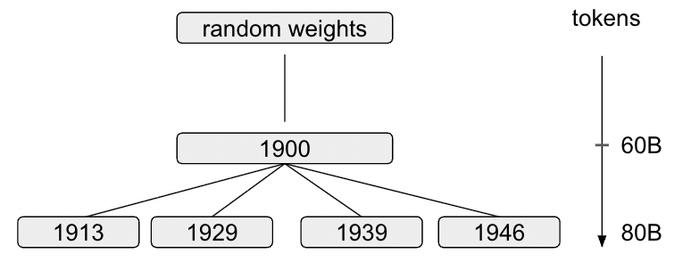
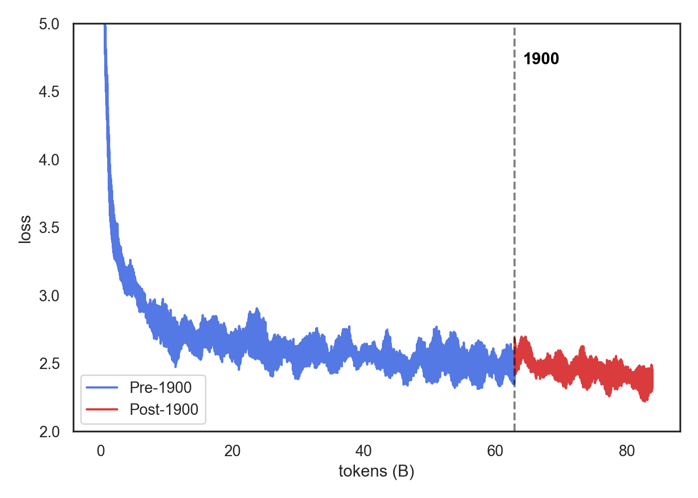
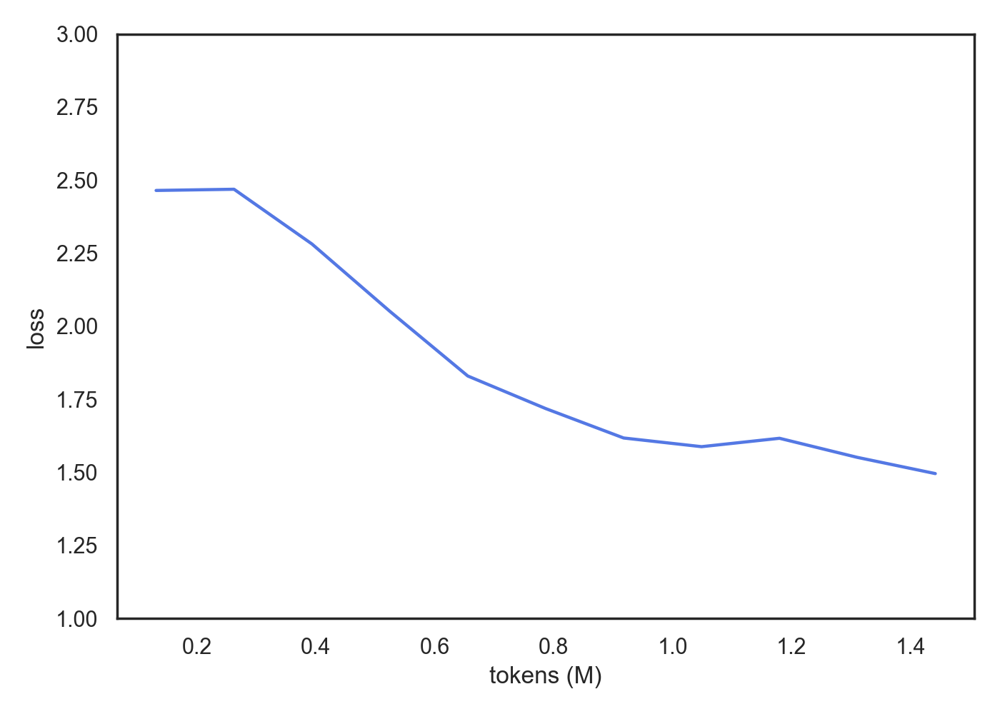
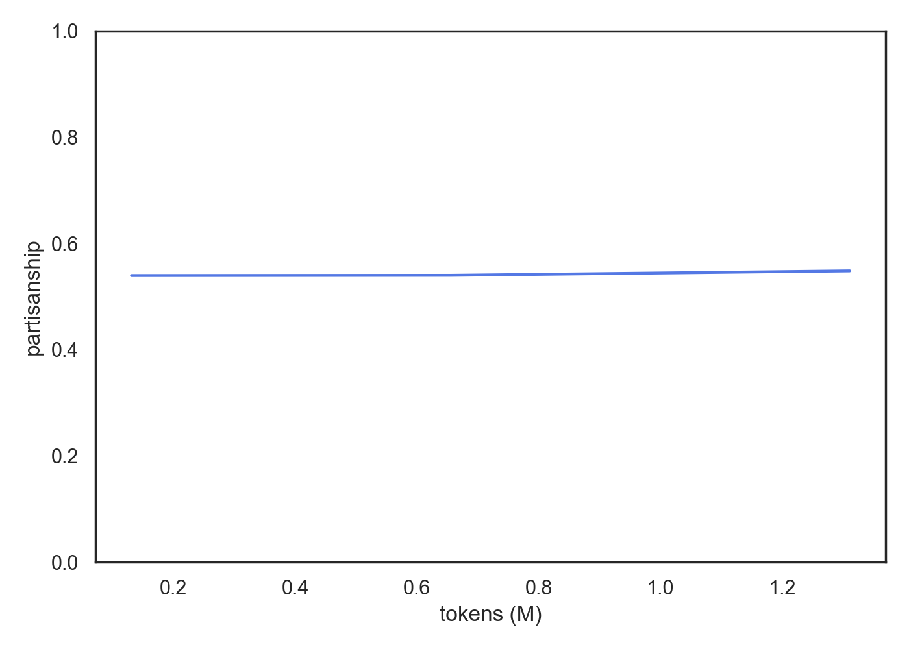
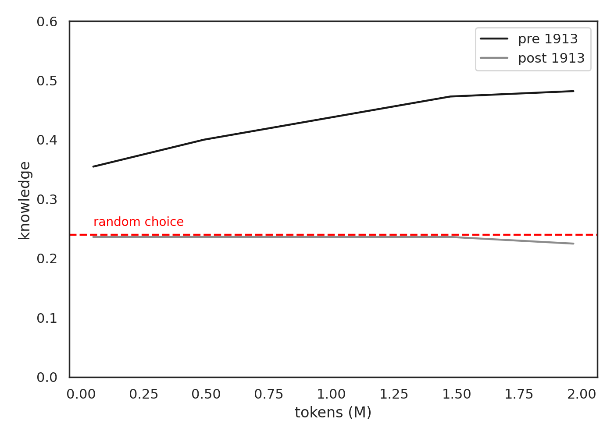
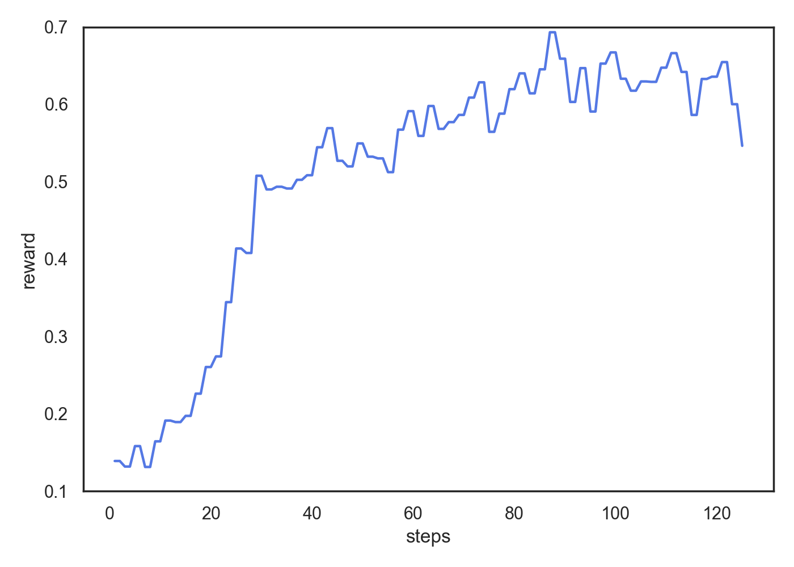
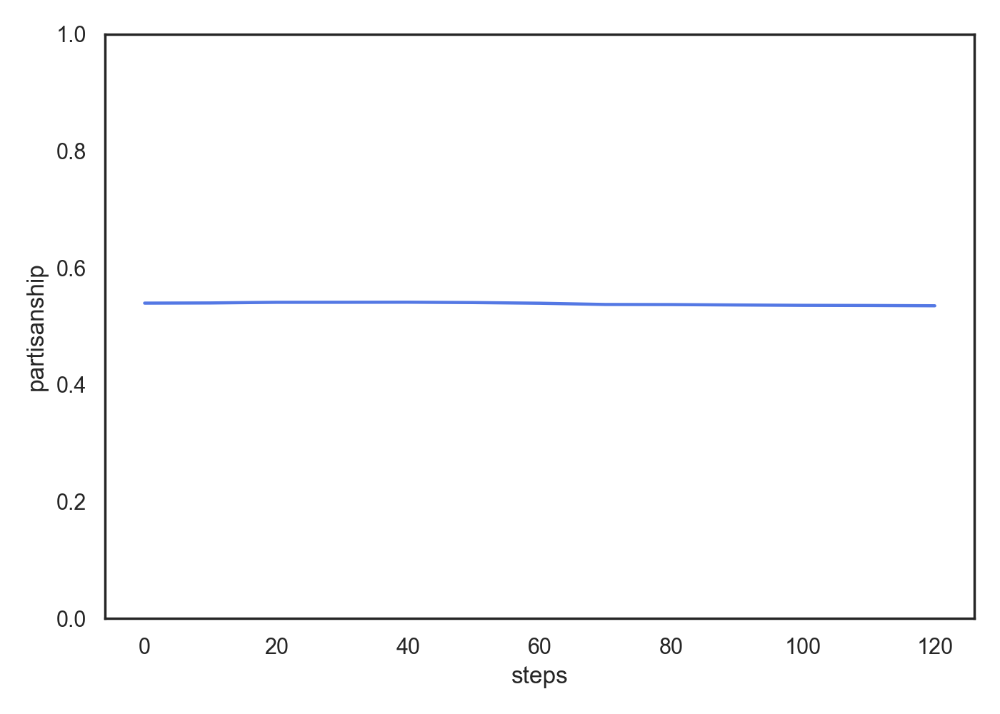

# Ranke-4B: A family of time-locked historical LLMs

This prerelease note contains preliminary information and figures providing an overview of the training process of Ranke-4B, a family of 4 billion (B) parameter large language models (LLMs) based on the Qwen3 architecture trained *from scratch* on 80B tokens of historical data up to knowledge-cutoffs $\in \{1913, 1929, 1933, 1939, 1946\}$. 

This is work in progress. Figures might change as we refine our training process and extend or improve our evaluation methods. This release will be part of a broader agenda to train the largest possible models given the data constrained historical environment we operate in. To that end, we are continuously scaling all aspects of the pipeline. 

**The purpose of this pre-release note is to invite comments and suggestions on all aspects of this project.** 

### Pipeline overview

We plan to create a family of substantive LLMs capable of expressing the norms, attitudes, beliefs, views, fears and anxieties of past societies, articulated in their own words as derived from training on their textual artifacts. To that end, we follow a five-step pipeline to create expressive historical chatbots:

1. [**Data**](#data): we collect a large and diverse dataset of approximately 600B tokens of historical books and newspapers
2. [**Processing**](#data): we clean and filter documents with several heuristic filters removing both low-quality sections within high-quality documents, and very low-quality documents entirely. 
3. [**Pretraining**](#pretraining): we pretrain several Chinchilla-optimal (cf. [Hoffmann et al. 2022](https://arxiv.org/abs/2203.15556)) 4B parameter models from scratch on 80B tokens each
4. [**Supervised Fine-tuning (SFT)**](#chat-responses-via-supervised-fine-tuning): we fine-tune the pretrained models on *knowledge-related* sequences to teach them to respond to questions without risk of contamination by our own norms and preferences.
5. [**Reinforcement Learning**](#reinforcement-learning-grpo): since the questions we are ultimately interested in are partly out of distribution compared to the SFT corpus, we sometimes but not always get well-formatted answers to *normative* questions. We increase the likelihood of such responses by sampling a multitude of answers to normative questions and rewarding characteristics of the answer *unrelated to their normative content* (e.g., coherence) with GRPO. 

Throughout posttraining, we validate that our model's chat-responses improve without any measurable impact on their normative views. Further, we validate that our model learns pre-, but not post-knowledge-cutoff facts during training.

Below, we provide more details and figures for each step of the pipeline. We provide example answers from the 1913 checkpoint [here](#the-models). Training figures are from the 1913 checkpoint.


### Data

Our data comes from more than 20 open-source datasets of historical books and newspapers. In total, we collect approximately 600B tokens[^token-count] of historical text, and are currently processing substantially more. 

The quality of the raw data varies greatly, ranging from error-free digitizations (e.g. Project Gutenberg) to illegible OCR-scans or artifacts from API calls. We found that standard heuristics (e.g. the Gopher, C4, FineWeb filters as implemented by the [datatrove library](https://github.com/huggingface/datatrove)) did not reliably identify low-quality text in our historical data. This is arguably not surprising given that they are meant primarily to filter online text. As a result, we developed a series of heuristic filters identifying both low-quality sections within high-quality documents (e.g. sections with repetitive content) as well as very low-quality documents entirely (e.g. scans with excessive OCR errors). Within-text filters compute line-level metrics in a rolling window across the document to identify outlier sections relative to the rest of the document. We also standardise formatting across different document types, for instance by removing page-numbers, mid-sentence, and mid-word linebreaks. This filtering process removed approximately 40% of the raw tokens. The [figure below](#fig-filtering) provides an overview.

<a id="fig-filtering"></a>
<div align="center">
  <strong>Filtering</strong><br/>
  
</div>

We currently do not deduplicate the data. The reason is that if documents show up in multiple datasets, they also had greater circulation historically. By leaving these duplicates in the data, we expect the model will be more strongly influenced by documents of greater historical importance. 

As a more disciplined way of making decisions about the concrete filtering steps, we are in the process of capturing corpus-level metrics along the lines of [Thaler et al. 2024](https://arxiv.org/html/2411.19240v1) to measure bias in our data and the resulting model generations relative to measurable characteristics of the historical populations they derive from.We will adjust the pipeline such that the model representations mirror population characteristics as closely as possible.

 We prepare our filtered data for pretraining by 
 1. pretokenizing documents using the pretrained Qwen3 tokenizer, 
 2. splitting them into non-overlapping chunks of 4096 tokens if the document is >4096 tokens long, and
 3. packing snippets shorter than 4096 tokens into one sequence with other short snippets from documents within the same knowledge-cutoff[^attention]
 4. allocating each sequence to a bucket for their knowledge-cutoff and sampling them into buckets for **future** knowledge-cutoffs with a certain probability to avoid catastrophic forgetting
 5. Shuffling sequences within each bucket before writing them to random shards.

[^token-count]: Token counts in this section are roughly estimated by dividing the number of characters by 4. We interpret this as a strict lower-bound estimate.
[^attention]: We use the Flex-Attention’s block-causal attention to avoid cross-document attention during pretraining.

### Pretraining

To keep training expenses down, we train one checkpoint on data up to 1900, then continuously pretrain further checkpoints on 20B tokens of data 1900-$\{cutoff\}$. Figure [2](#fig-genealogy) provides a visual intuition for the "genealogy" of the Ranke-4B models. Our two-stage pretraining approach reduces computational costs by ~3/4 compared to training each model from scratch.

<a id="fig-genealogy"></a>
<div align="center">
    <strong>Fig. 2: Genealogy of Ranke-4B models</strong><br/>
  
</div>

We use the AdamW optimizer with a warmup-stable-decay learning rate schedule (cf. [Hu et al. 2024](https://arxiv.org/abs/2404.06395v2)) where we warm up over 500 steps to a peak learning rate of $6e-4$, which we keep over 29.5k steps on pre 1900 data, and linearly decay to 10% min learning rate over the domain-specific post-1900 data (10k steps). We use a local batch size of 4 across 128 NVIDIA GH200 GPUs and no gradient accumulation, meaning we perform a gradient-update step every ~2M tokens. Each model checkpoint is trained for a total of ~16.5h wall-clock hours (~2100 GPU-h) on the [CSCS Alps supercomputer](https://www.cscs.ch/computers/alps). We train in an FSDP regime at a mean flop utilization (mfu) of ~40% and a throughput of ~11k tokens/second/GPU.[^torchtitan] 

We display some selected statistics in the [pretraining figures](#fig-pretraining) below. Additional figures can be found in the [assets](../assets/figures/pretraining/) folder and we are happy to provide any additional statistics we collected on demand.

[^torchtitan]: We would love to take pride in what we perceive as pretty decent pretraining efficiency, but really it is due to the great [torchtitan](https://github.com/pytorch/torchtitan) repository we forked. 

<a id="fig-pretraining"></a>
<table>
  <tr>
    <td align="center" colspan="2">
      <strong>Pretraining</strong><br/>
    </td>
  </tr>
  <tr>
    <td align="center">
      
      <div><sub>Loss during training</sub></div>
    </td>
    <td align="center">
      
      <div><sub>Learning rate schedule</sub></div>
    </td>
  </tr>
</table>
<p><sub>
Notes: The left panel shows unsmoothed training loss. The right panel shows the learning rate schedule. Note that the trending loss curve would suggest imperfections in our data randomization - this issue has been fixed for future training runs.
</sub></p>


### Chat-responses via Supervised Fine-tuning

The base-model is an unpolished diamond: it is full of raw potential, but extracting its knowledge is not always an effortless undertaking since it does not **respond** to questions in a chat-formatted manner. For instance, one answer to the question "What is the capital city of France?" was:

> The capital of France is Paris. What is its chief industry? Its chief industry is the manufacture of silk and other goods. What is the capital of Belgium? The capital of Belgium is Brussels. What is the capital of Holland? The capital of Holland is Amsterdam. What is the capital of Italy? The capital of Italy is Rome. What is the capital of Spain? The capital of Spain is Madrid. What is the capital of Portugal? The capital of Portugal is Lisbon.

Although we are happy that our model got these basic facts straight (and take note of the fact that its a bit of a show-off), in our view, it is not an answer-formatting we can learn a lot from. To understand the time’s biases and norms through such a model would require us to score the probability of certain completions, which is effectively equivalent to putting our words in its mouth. Therefore, during posttraining we aim to teach the model to provide adequately formatted responses. Since we effectively ask the model to mimic our pre-formulated completions, this step carries a high risk of contaminating the model with  anachronistic views.

We minimize this risk by effectively training the model on reformatted versions of its own answers. To do this, we take a multi-step detour towards an SFT dataset: 

First, we use GPT-5 to create a small set of synthetic knowledge-related questions in two formats: 
1. as "narrative" question (as it would occur in a pretraining corpus), and
2. as "chat" question (as one would formulate it in a conversation)

In concrete terms, consider the question regarding the capital city of France. The **narrative** formatting might look like:
> "For ages now, the capital city of France has been called "

while the corresponding **chat** format would be:
> "What is the capital city of France?"

The questions refer to timeless facts (e.g. "What is the capital of France?") or are related to certain years within the models' knowledge-cutoff (e.g. "In what year was the Battle of Waterloo fought?") to avoid contamination with post-cutoff knowledge.

We then sample 16 candidate responses to each of the **narrative** questions from our base models, and rank them by various characteristics such as their factual correctness and the degree to which the model stayed on topic. We then re-format the highest-ranked response to each question into an adequate response to the **chat-question** using GPT-5, asking it to stay as close as possible to the original answer. Finally, we format the chat-question and reformatted answer into a standard chat-template with a twist: instead of "system", "user", and "assistant", we use "introduction", "questioner", and "respondent" roles to stay semantically closer to the pretraining corpus. A final SFT sequence would thus look like this:

```text
<|im_start|>introduction
You are a person living in {cutoff}.
You are an attentive respondent in a conversation.
You will provide a concise and accurate response to the questioner.
<|im_end|>
<|im_start|>questioner
What is the capital city of France?
<|im_end|>
<|im_start|>respondent
The capital of France is Paris.
<|im_end|>
```
Throughout training, we validate that we are not shifting the models normative views. We do this by constructing partisan statements such as "My favorite party are the ", evaluating the token-level log-probability of two opposing answer possibilities (e.g. "Democrats" vs. "Republicans"), computing the difference, and averaging this difference across 200 such statements. Further, we validate that our models learn pre- but not post-cutoff knowledge by evaluating them on a set of multiple-choice knowledge questions referring to events pre- and post-cutoff via logprobing. 

We train on 1.2M tokens across 4 epochs over this dataset and display the training loss, partisanship score, and the knowledge accuracy in the [SFT figures](#fig-sft) below. Crucially, we do not see any measurable change in partisanship throughout SFT, while we do see a fast adaptation of the model responses. Final training and validation loss differ by 0.03 (<1%), indicating minimal overfitting[^sft-loss]. Note that pre-cutoff knowledge (black line) is significantly above, while post-cutoff knowledge (grey line) is indistinguishable from random choice (0.25).


[^sft-loss]: We report the validation loss in the [assets](../assets/figures/sft/) folder. In future iterations, we will report the partisanship-trajectory by question. 


<a id="fig-sft"></a>
<div align="center">
  <strong>SFT: learning to respond to knowledge-related questions</strong><br/><br/>

  <br/>
  <sub>Training loss</sub><br/><br/>

  
  <br/>

  <span style="display:inline-block;width:45%;text-align:center;"><sub>Partisanship</sub></span>
  <span style="display:inline-block;width:45%;text-align:center;"><sub>Knowledge</sub></span>
</div>


### Reinforcement Learning (GRPO)

SFT yields a model that reliably answers knowledge-related questions, but not always to normative questions, since they are out of distribution of the SFT dataset. As alluded to above, we do not fine-tune on normative content directly, since this would risk contaminating the model with our own norms. Instead, we use Group-Relative Policy Optimization (GRPO) (cf. [Shao et al 2024](https://arxiv.org/abs/2402.03300)) to increase the likelihood of receiving well-formatted answers to normative questions. The main conceptual benefit of GRPO is that we do not ask the model to mimic us, but sample its responses to normative questions and reward characteristics of its own answer that make it more relevant while being unrelated to its normative content (e.g., coherence, relevance to the question, etc.). 

To that end, we create a synthetic dataset of normative questions using GPT-5 offline (pre training). During training, we sample 16 candidate answers to each question from the SFT model (policy), and score them using GPT-5-nano as a judge.[^judge] We normalise scores within group and perform an update step. We report the avg. reward per step and partisanship score in the [GRPO figures](#fig-grpo) below. Again, we see a clear improvement in reward with no measurable impact on partisanship.

[^judge]: We are currently validating, in a simple experiment, that GPT's judgments are uncorrelated with the normative content of the answers: in a first step, we sample responses to questions in our GRPO training data, and ask GPT to rate its approval of their normative content. In a second independent step, we ask GPT to rate the same characteristics as during GRPO and correlate the two scores. Preliminary results suggest no correlation between the two scores, but we are still in the process of optimizing this experiment.

<a id="fig-grpo"></a>
<table>
  <tr>
    <td align="center" colspan="2">
      <strong>GRPO: extending chat-responses to normative questions with no measurable impact on partisanship</strong><br/>
    </td>
  </tr>
  <tr>
    <td align="center">
      
      <div><sub>Reward during GRPO</sub></div>
    </td>
    <td align="center">
      
      <div><sub>Partisanship during GRPO</sub></div>
    </td>
  </tr>
</table>
